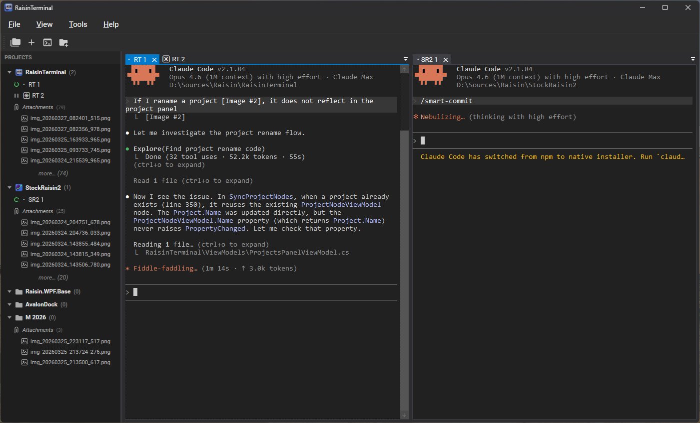

# RaisinTerminal

Windows terminal emulator with multi-pane layout and Claude Code session management.



## Features

- **Full terminal emulation** — ConPTY-based with VT100/ANSI support, alternate screen buffer, scrollback, and Unicode block drawing
- **Multi-pane layout** — AvalonDock docking with drag-and-drop tab management
- **Split view** — pinned pane for side-by-side terminal output with per-canvas viewport rendering
- **Claude Code awareness** — detects session status (idle/working/waiting), manages session names, and tracks per-project state
- **Projects panel** — groups terminal sessions by working directory with per-project attachments and icon auto-detection
- **Customizable keybindings** — rebindable keyboard shortcuts via the Options dialog
- **Session persistence** — saves and restores working directory, last command, and alternate screen state across restarts
- **Clipboard integration** — paste images and drag-and-drop file paths directly into terminals
- **Search** — Ctrl+F to find text in terminal scrollback with highlight navigation
- **Command history** — cross-session history with search (max 500 entries)

## Requirements

- Windows 10 version 1809+ (ConPTY support)
- .NET 8 Runtime

## Building

```bash
dotnet build RaisinTerminal.slnx
```

The project references sibling Raisin libraries via `ProjectReference` by default. For standalone builds using NuGet packages:

```bash
dotnet build RaisinTerminal.slnx -p:UseProjectReferences=false
```

## Running

```bash
dotnet run --project RaisinTerminal/RaisinTerminal.csproj
```

## Testing

```bash
dotnet test RaisinTerminal.Tests/RaisinTerminal.Tests.csproj
```

## Architecture

WPF app (.NET 8, C#) using MVVM with three projects:

- **RaisinTerminal** — WPF UI (Views, ViewModels, Services, Controls)
- **RaisinTerminal.Core** — Terminal emulation engine (no UI dependency)
- **RaisinTerminal.Tests** — xUnit tests (terminal emulation, resize regression, viewport math)
- **RaisinTerminal.Tests.UI** — WPF rendering tests

### Terminal pipeline

```
Keyboard → InputEncoder → ConPtySession → child process
child process → AnsiParser → TerminalEmulator → TerminalBuffer → TerminalCanvas (WPF render)
```

## License

[MIT](LICENSE)
